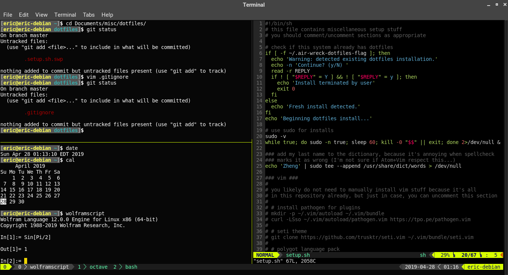

# dotfiles `~/.*`
This repository stores some useful config files. It is not necessarily intended to be exhaustive. There are (mostly) two kinds of files in this repository:

* Actual dotfiles (`.*`, mostly): settings for some programs I use
* Setup files (`setup.sh`, `manual-list`): convenient setup script for some things I like to have, designed specifically for Debian Linux. I may have to expand at some point, because apparently `unix.andrew.cmu.edu` is running RedHat.

*Special note for cloning:* to get all the vim bundles, you'll need to clone with:

``` sh
git clone --recurse-submodules https://github.com/air-wreck/dotfiles.git
```

Otherwise, see `setup.sh` for getting the bundles.

Here's an example of what it all looks like:



